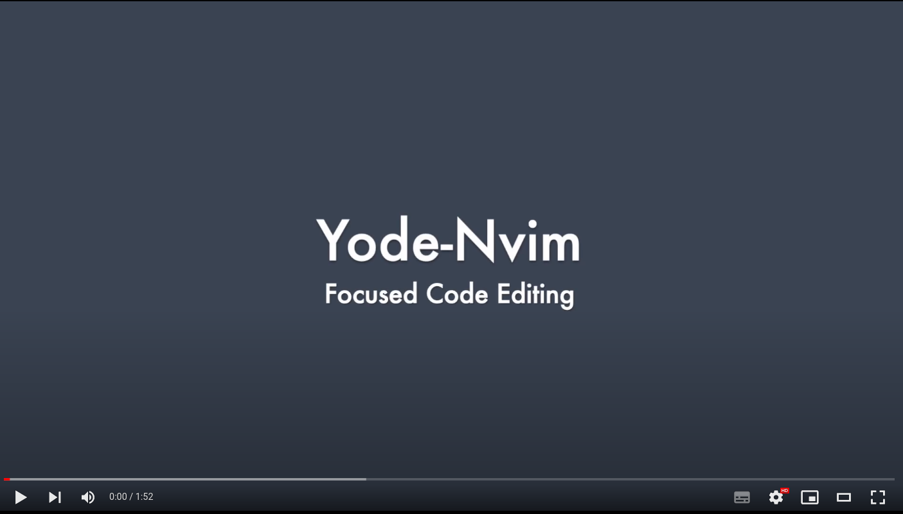

# Yode-Nvim

| [HackerNews](https://news.ycombinator.com/item?id=30305011) | [reddit](https://www.reddit.com/r/neovim/comments/sq5yfn/yodenvim_focused_code_editing_for_neovim/) |

[Yode](https://github.com/hoschi/yode) plugin for [NeoVim](https://neovim.io/)

Focus on the important parts of the code. Hide the rest, literally. With
Yode-Nvim you can go deeper than the file level, picking out the lines that are
important for the current task. Whether you want to focus on important parts of
a large file, or collect small parts of many files, you can see everything at a
glance. Zoom from the focused part back into the file to briefly expand your
context or adjust your focus. Everything happens in the editor, the rest of the
tool chain still works, this makes Yode-Nvim work for any programming language,
framework, etc.

For the past six months, I've been using this MVP in its various stages in
development for Yode-Nvim itself. Currently I am working on fixing minor bugs
and integrating more plugins.

## Introduction Video

[](https://www.youtube.com/watch?v=4jXGKmBrD5g)

For a more in-depth introduction to the idea of Yode, check out the
[video of the proof of concept](https://github.com/hoschi/yode)!

## GIFs

Neomake error linting with correct error placement:


https://user-images.githubusercontent.com/163128/153627026-e346eb0c-b7e9-4bef-986f-79cb64dadfac.mp4


Code formatter changes file buffer and seditor:


https://user-images.githubusercontent.com/163128/153627139-d93ab368-0270-4bff-9c81-dc1441a2c934.mp4


`Gread` to restore file with git:


https://user-images.githubusercontent.com/163128/153627156-00f69076-d614-49ed-b066-b83b2dfcfe73.mp4


## Features & Commands

* `YodeCreateSeditorFloating` focus on a code part and make it floating, stay
  at the current (main) view
* `YodeCreateSeditorReplace` focus on a code part and replace it with the
  current buffer
* `YodeBufferDelete` delete the current buffer and jump back to file, if it is
  a seditor
* `YodeGoToAlternateBuffer` Yode-Nvim creates buffer local mappings for these
  commands, see `lua/yode-nvim/createSeditor.lua` for all mappings
* `YodeCloneCurrentIntoFloat` clone seditor into float
* `YodeFloatToMainWindow` is the opposite
* `YodeFormatWrite` formats and writes a buffer, no matter which type
* `YodeRunInFile` can run a command in the current file or the file buffer of
  the current seditor
* changes from outside are tried to be applied as good as possible. If this
  does not work so well, seditors can change the size 
* in general there are different layouts for the floating windows, but at the
  moment there is only one
* see the next section for more details

## Installation

You need at least Neovim 0.6. Add Plenary and Yode-Nvim to your config, e.g.
with
[vim-plug](https://github.com/junegunn/vim-plug):

```viml
Plug 'nvim-lua/plenary.nvim'
Plug 'hoschi/yode-nvim'
```

Important is that this repo is cloned with submodules, which happens automatically
when you use vim-plug. The minimal setup is this:

```viml
lua require('yode-nvim').setup({})
```

Check out the help section for a more sophisticated configuration.

## Interim Help

**TODO** move this to Vim help syntax `./doc/yode-nvim.txt`.
[kdheepak/panvimdoc: Write documentation in pandoc markdown. Generate documentation in vimdoc.](https://github.com/kdheepak/panvimdoc)

* install
    * use your favorite plugin manager, important is to include the git submodules
    * clone with submodules: `git clone --recurse-submodules git@github.com:hoschi/yode-nvim.git`
* log is written to cache dir of `stdpaths`
    * the default level is 'warn', but can be configured. Level can also be
      overwritten with an environment variable, see the Development section for
      more info.
    * TODO link here how to echo this dir
    * e.g. `~/myuser/.cache/nvim/yode-nvim.log`
* example setup:

```viml
lua require('yode-nvim').setup({})
map <Leader>yc      :YodeCreateSeditorFloating<CR>
map <Leader>yr :YodeCreateSeditorReplace<CR>
nmap <Leader>bd :YodeBufferDelete<cr>
imap <Leader>bd <esc>:YodeBufferDelete<cr>
" these commands fall back to overwritten keys when cursor is in split window
map <C-W>r :YodeLayoutShiftWinDown<CR>
map <C-W>R :YodeLayoutShiftWinUp<CR>
map <C-W>J :YodeLayoutShiftWinBottom<CR>
map <C-W>K :YodeLayoutShiftWinTop<CR>
" at the moment this is needed to have no gap for floating windows
set showtabline=2
```

* compatible plugins with current change detection logic
    * [tpope/vim-fugitive: fugitive.vim: A Git wrapper so awesome, it should be illegal](https://github.com/tpope/vim-fugitive)
        * `Gread` works by using one or two change events
* `YodeRunInFile` works only with synchronous commands, e.g. `Gread`. Not with
  async commands like `FormatWrite`
* adapted plugins
    * [mhartington/formatter.nvim](https://github.com/mhartington/formatter.nvim)
        * uses `nvim_buf_set_lines` for one `change/add` event, but is async
        * [adapted version to install](https://github.com/hoschi/formatter.nvim)
    * [neomake/neomake: Asynchronous linting and make framework for Neovim/Vim](https://github.com/neomake/neomake)
        * uses API methods of `api.lua` to be aware of file vs seditor buffers
        * [adapted version to install](https://github.com/hoschi/neomake)
* overlapping/nested seditors are not supported at the moment
    * see TODO statements in `onSeditorBufferLines`
    * other parts of code as well, probably not documented

## Development

* [Lamda module help](https://moriyalb.github.io/lamda/)
* start Neovim with `DEBUG_YODE='debug' nvim` to set log level
    * TODO link to modes
    * "trace" shows state changes as well
* see log file:
    * `tail -f ~/.cache/nvim/yode-nvim.log | grep -v "^\["`
    * last part removes the file name lines
* format files
    * install `stylua`
    * `make format`
* lint files
    * install `luacheck`
    * `make lint`
* see `local.vimrc` for enhancements
    * rename to `.local.vimrc` to use it
    * [install nvim plugin for it](https://github.com/thinca/vim-localrc)
    * start Neovim with `YODE=true DEBUG_YODE='debug' nvim` to enable special parts for testing
* install local Lua
    * install [Hererocks](https://github.com/mpeterv/hererocks)
    * setup environment with `hererocks env -l5.1 -rlatest`
    * source environment with `source env/bin/activate`
    * install packages you want to use in REPL, e.g. `luarocks install inspect`
* REPL
    * source environment as showed above
    * `cd lua` to go into the same path Neovim saves Lua files
    * start a REPL with `lua`
    * require installed luarocks packages, e.g. `inspect = require('inspect')`
    * require local deps by copy/paste from source, e.g. `R = require('yode-nvim.deps.lamda.dist.lamda')`
    * require source code, e.g. `h = require('yode-nvim.helper')`
    * play with the code which works, everything using `vim.XYZ` will fail
* test JS development
    * `npm ci` to install dependencies
    * now you can setup Neomake for the JS files in `testData/`
* run tests:
    * running tests requires
      [plenary.nvim](https://github.com/nvim-lua/plenary.nvim) to be checked
      out in the parent directory of *this* repository
    * run all tests: `make test`
    * run single test: `nvim --headless -c "PlenaryBustedDirectory lua/yode-nvim/tests/e2e/seditor_to_file_editor_sync_spec.lua {minimal_init = 'lua/yode-nvim/tests/minimal.vim'}"`
    * [more infos, see Plenary docs here](https://github.com/nvim-lua/plenary.nvim#plenarytest_harness)
    * run all tests on file changes `nodemon -e lua,vim --exec 'make test'`
    * run single test on file changes `nodemon -e lua,vim --exec "nvim --headless -c \"PlenaryBustedDirectory lua/yode-nvim/tests/e2e/basic_mosaic_layout_spec.lua {minimal_init = 'lua/yode-nvim/tests/minimal.vim'}\" "`
    * run single test file and log `DEBUG_YODE='trace' nvim --headless -c "PlenaryBustedDirectory lua/yode-nvim/tests/e2e/recover_seditor_with_undo_spec.lua {minimal_init = 'lua/yode-nvim/tests/minimal.vim'}"`
